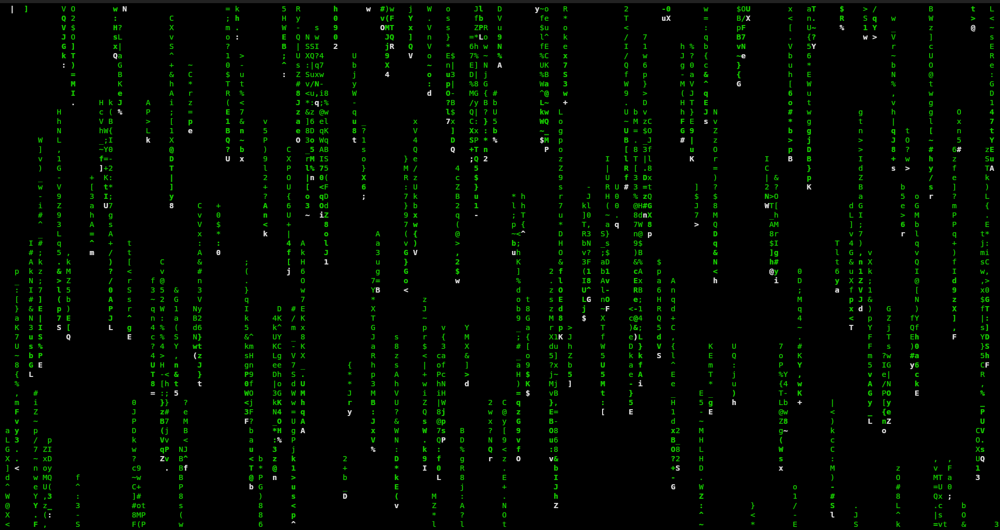

# PYMATRIX

_**just a side project...**_

Trying to recreate the Matrix-style digital rain effect for the terminal.

## 🚀 Quick Navigation

| Topics                 | Link                                                                                                    |
| ---------------------- | ------------------------------------------------------------------------------------------------------- |
| Project Overview       | [About ➤](#overview)                                                                                    |
| Captures               | [Screenshot ➤](#-screenshot) <br> [ScreenCast ➤](#-screencast)                                          |
| Upcoming Features      | [Working on... ➤](#upcoming-features)                                                                   |
| Installation and Usage | [Dependencies ➤](#dependencies) <br> [Install Guide ➤](#installing-dependencies) <br> [Usage ➤](#usage) |
| Contributions          | [Contributing ➤](#contribution)                                                                         |
| License                | [Project License](#license)                                                                             |

<br>

### 📖 OVERVIEW

Matrix Rain is a lightweight terminal application that recreates the iconic "digital rain" effect from The Matrix movie. Written in pure Python using only standard library modules, it provides an authentic Matrix experience with cascading green characters, random speeds, and flickering effects.

Current Version: 1.0

<br>

### 📸 Captures

#### 🔸 Screenshot

On default settings:

<p align="center">
	
</p>

#### 🔸 Screencast

<p align="center">
	
</p>

<br>

### ⚙️ Upcoming Features

- [ ] Customizable colors (red, blue, custom RGB)
- [ ] Adjustable speed and density controls
- [ ] Command-line arguments for configuration
- [ ] Different character sets (Katakana, custom symbols)
- [ ] Rain intensity levels (light, medium, heavy)
- [ ] Pause/resume functionality
- [ ] Configuration file support
- [ ] Multiple visual modes (classic, random, wave)

<br>

### 🛠️ Installation and Usage

#### Dependencies

This project uses only Python's standard library, making it extremely lightweight with minimal dependencies.
Required

Python3+ - The core runtime
python3-curses - Terminal manipulation library (usually included with Python)

#### Installing Dependencies

🔸 For Ubuntu/Debian

```
sudo apt-get install python3 python3-curses
```

- On most systems, curses comes pre-installed with Python. If you encounter import errors, install the curses package using your system's package manager.

🔸 Verify Dependencies

```
python3 --version
python3 -c "import curses; print('curses OK')"
```

#### Project Installation: Clone and Run

```
# Clone or download this repository
git clone https://github.com/nihalsheikh/pymatrix.git
```

#### Usage

Two Methods to run the code

```
<!-- 001 -->
# Go inside the project directory
cd pymatrix

# Run with Python
python3 pymatrix.py
```

```
<!-- 002 -->
# Go inside the project directory
cd pymatrix

# Make the script executable
chmod +x pymatrix.py

# and then Run it
./matrix_rain.py
```

#### Controls

`q` - Quit the program gracefully
`Ctrl+C` - Force exit

<br>

### 🙌 Contribution

Contributions are welcome! Feel free to:

- 🐞 Report bugs
- 💡 Suggest new features
- 📝 Submit pull requests
- 📝 Improve documentation

<br>

### 📜 License

This project is licensed under the GNU General Public License v3.0 - see the [LICENSE](LICENSE) file for details.
