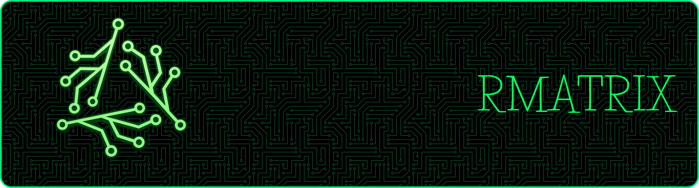

# Rmatrix - Personal Digital Rain Animation

[](https://pypi.org/project/rmatrix/)
[](https://opensource.org/licenses/MIT)



Rmatrix is a fun and creative digital rain animation for your terminal, inspired by the iconic visuals of The Matrix. It features 3D parallax depth, hand-calibrated 256-color palettes, and a customizable bookmark overlay. Built for the casual aesthetic, it's dependency-free and runs on anything with Python 3.6+.

## 🎬 Live Demo

Check out the interactive high-fidelity website at [rmatrix.vercel.app](https://rmatrix.vercel.app).

## ✨ Features

- **Pure Python:** No heavy dependencies, no bloat.
- **Cinematic Visuals:** High-fidelity animation optimized for the terminal.
- **Extreme Customization:** Over 20+ flags to tune speed, density, colors, and mutation rates.
- **Color Palettes:** 10+ hand-crafted color schemes (Classic Green, Blood Red, Ocean Blue, Sunset, etc.).
- **Zero Data:** Respects your privacy. No tracking, no telemetry.

## 🚀 Installation

To install Rmatrix officially from PyPI:

```bash
pip install rmatrix
```

Or run it directly without installing:

```bash
python3 -m rmatrix.main
```

## 🎮 Usage

Simply run:

```bash
rmatrix
```

Or use the shorter alias:

```bash
rmx
```

### Pro Examples:

**High-speed Gold rain with long trails:**
```bash
rmatrix -c gold -ch digits -l long -df
```

**Cyan rain with a custom "NEO" bookmark:**
```bash
rmatrix -b "NEO" -c cyan
```

## 🛠 Requirements

- Python 3.6+
- A terminal with `curses` support (standard on Linux/macOS)
- Windows: Use Windows Terminal or PowerShell for the best experience.

## 📄 License

This project is licensed under the MIT License - see the [LICENSE](LICENSE) file for details.

---
Built with ❤️ for the community by Nihal Sheikh.
