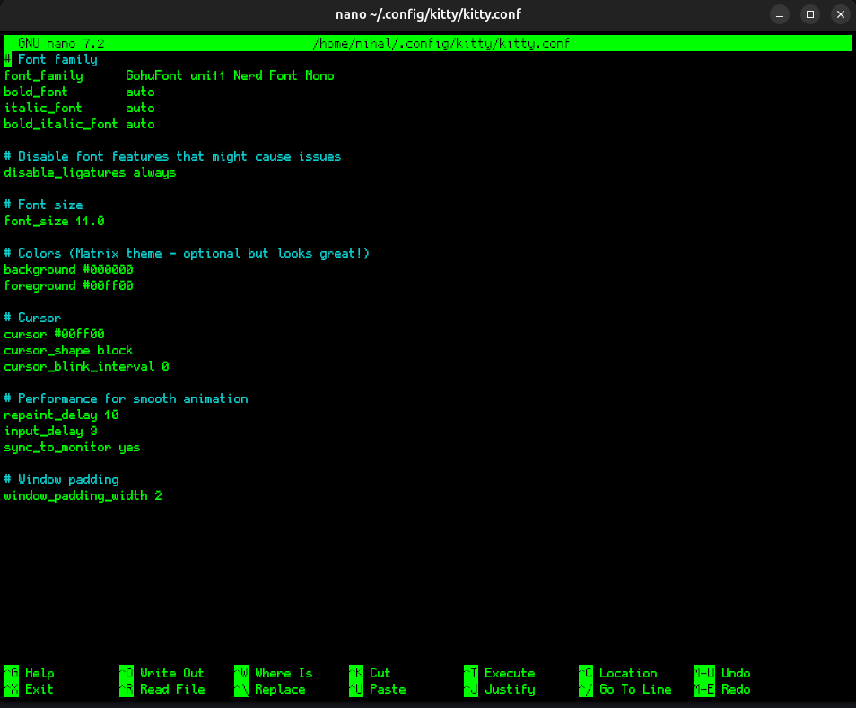
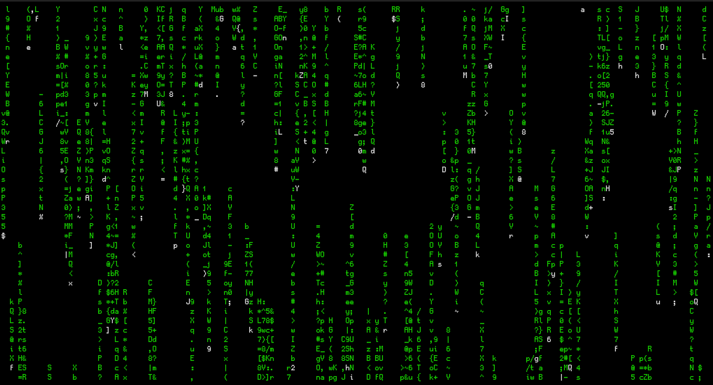

<!-- banner -->


<h1 align="center">Terminal Configuration</h1>

<hr style="height: 4px; background-image: linear-gradient(to right, #00FF00, #008000); border: 0;">

## Quick Navigation

| Topic             | Link                                                              |
| ----------------- | ----------------------------------------------------------------- |
| Prerequisites     | [Requirements ➤](#prerequisites)                                  |
| Font Installation | [Font-config ➤](#install-the-font)                                |
| Terminal Config   | [Kitty-config ➤](#configure-kitty-terminal)                       |
| My Config         | [OP Config ➤](#my-current-terminal-configuratiosn-are-as-follows) |
| Captures          | [Images ➤](#captures)                                             |

<hr style="height: 4px; background-image: linear-gradient(to right, #00FF00, #008000); border: 0;">

### Prerequisites

1. A Terminal, you might already have it, if not you can try [Kitty ➤](https://sw.kovidgoyal.net/kitty/)

2. GohuFont Nerd Font. This is optional but i liked this font on my terminal [Nerd Font Page ➤](https://www.nerdfonts.com/font-downloads)

### Install the font

```
# Create fonts directory if it doesn't exist
mkdir -p ~/.fonts

# Copy the font files to the fonts directory
cp GohuFont*.ttf ~/.fonts/

# Or install system-wide (requires sudo)
sudo cp GohuFont*.ttf /usr/share/fonts/truetype/

# Refresh font cache
fc-cache -fv
```

#### Verify Font Installation

```
# List all installed fonts and filter for GohuFont
fc-list : family style | grep -i gohu
```

**Expected Output**: You should see something like this in your terminal

```
GohuFont uni11 Nerd Font Mono:style=Regular
GohuFont uni14 Nerd Font Mono:style=Regular
GohuFont 11 Nerd Font Mono:style=Regular
GohuFont 14 Nerd Font Mono:style=Regular
```

<hr style="height: 4px; background-image: linear-gradient(to right, #00FF00, #008000); border: 0;">

### Configure Kitty Terminal

- Generally the Kitty config file is located at:

```
~/.config/kitty/kitty.conf
```

<br>

- If it doesn't exist, create it:

```
mkdir -p ~/.config/kitty
touch ~/.config/kitty/kitty.conf
```

<br>

- Edit the Kitty Config File:

```
<!-- Choose anyone cmd -->
nano ~/.config/kitty/kitty.conf
# or
vim ~/.config/kitty/kitty.conf
```

<br>

- Add the following to your config file:

```
# Font Configuration
font_family      GohuFont uni14 Nerd Font Mono
font_size        14.0
bold_font        auto
italic_font      auto
bold_italic_font auto

# Disable ligatures (important for bitmap fonts)
disable_ligatures always
```

<br>

- Save the config:

  - For **nano**: Press `Ctrl+O` to save, Press `Enter` then `Ctrl+X` to exit

  <br>

  - For **vim**: Press `Esc`, type `:wq`, press `Enter`

### Close Kitty and Restart Terminal

- Close all Kitty windows
- Open Kitty again

<hr style="height: 4px; background-image: linear-gradient(to right, #00FF00, #008000); border: 0;">

## My current Terminal Configurations are as follows:

- Kitty Terminal: [Kitty ➤](https://sw.kovidgoyal.net/kitty/)
- GohuFont Nerd Font: [Nerd Font Page ➤](https://www.nerdfonts.com/font-downloads)

- The following Kitty Configuartion for terminal

```
# Font family
font_family      GohuFont uni11 Nerd Font Mono
bold_font        auto
italic_font      auto
bold_italic_font auto

# Disable font features that might cause issues
disable_ligatures always

# Font size
font_size 11.0

# Colors (Matrix theme - optional but looks great!)
background #000000
foreground #00ff00

# Cursor
cursor #00ff00
cursor_shape block
cursor_blink_interval 0

# Performance for smooth animation
repaint_delay 10
input_delay 3
sync_to_monitor yes

# Window padding
window_padding_width 2
```

<hr style="height: 4px; background-image: linear-gradient(to right, #00FF00, #008000); border: 0;">

## Captures

### 🔸 Screenshot

|  |  |
| ------------------------------------ | --------------------------------------------------------- |

### 🔸 Screencast


